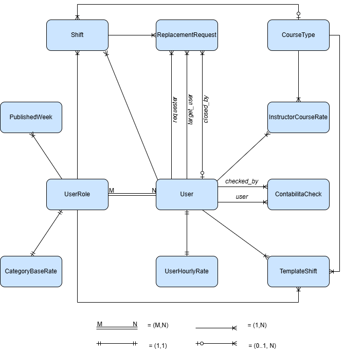
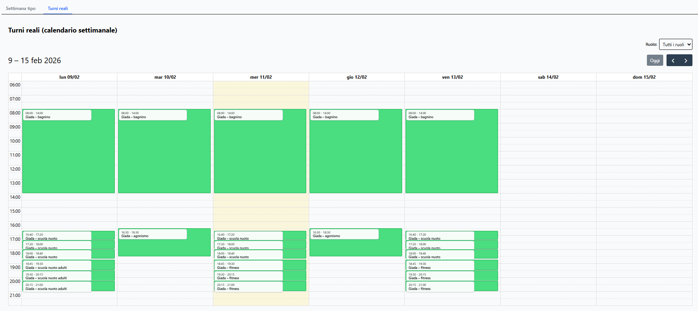
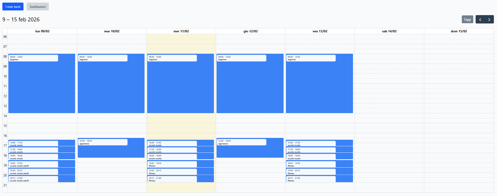
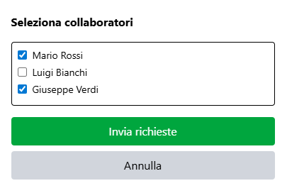
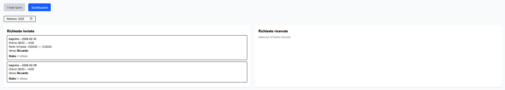
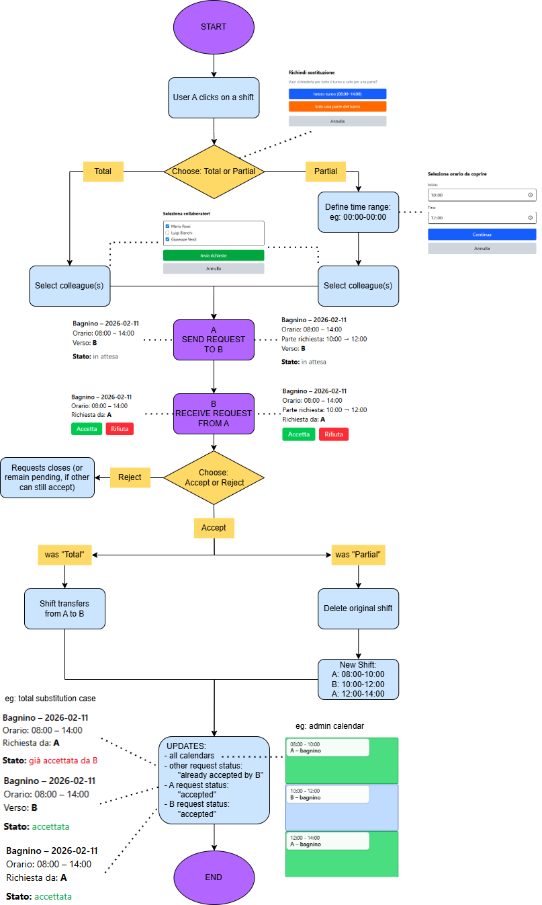
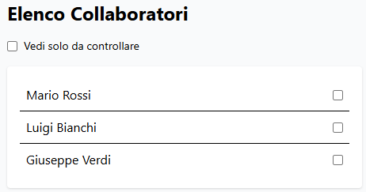

# ShiftManager: Application for staff shift management, substitution requests, and automatic compensation calculation**

> University of Trento  
> Department of Information Engineering and Computer Science  
> Master's Degree in Information Engineering  
> Project course  

> Author: Riccardo Zannoni - riccardo.zannoni@studenti.unitn.it  
> Date: February 2026

---

## Table of Contents

1. [Introduction](#1-introduction)
2. [How to run the project](#2-how-to-run-the-project)
3. [System Architecture](#2-system-architecture)
   - [Backend Structure](#21-backend-structure-django)
   - [Frontend Structure](#22-frontend-structure-react)
4. [Data Model](#3-data-model)
   - [ER Diagram](#31-conceptual-schema-entityrelationship-diagram)
   - [Logical Schema](#32-logical-schema)
5. [Main Frontend Features](#4-main-frontend-features)
   - [Admin Dashboard](#41-admin-dashboard-shift-management)
   - [Employee Dashboard](#42-employee-dashboard-shift-viewing-and-substitution-management)
   - [Accounting Dashboard](#43-accounting-dashboard)
6. [REST API Architecture](#5-rest-api-architecture)
7. [Security and Authentication](#6-security-and-authentication)
8. [Conclusion](#7-conclusion)

---

## 1. Introduction

ShiftManager is a full-stack web application designed to streamline staff shift management within sports organizations, particularly swimming pools. The system supports **three user profiles** with role-specific functionalities:

- **Administrators** create template-based schedules and publish shifts for various roles (lifeguards, instructors, receptionists)
- **Collaborators** view their assignments and can request replacements from colleagues for their shifts
- **Accountants** access automated payroll tools to calculate monthly compensation based on customizable rates

**Technology stack:**

| Layer | Technology |
|-------|-----------|
| Backend | Django 5.2.8 + Django REST Framework 3.16.1 |
| Frontend | React 19.1.1 + Vite 7.1.7 |
| Database | SQLite (development) → PostgreSQL (production) |
| Authentication | JWT (djangorestframework-simplejwt) |
| UI | FullCalendar 6.1.19 + Tailwind CSS 4.1.17 |

**Structure of the project:**

```
📁ShiftManager
|
|   # backend
├── 📁 core
├── 📁 courses
├── 📁 shifts   
├── 📁 users
├── 🐍 manage.py
|
|   # frontend
├── 📁 frontend
|
├── 📁 docs
|   ├── ▶️ ShiftManagerDemo.mp4   # example of app use
│   └── 📕 ShiftManager.pdf # report of the project
|
├── 📝 README.md
└── 📄 requirements.txt
```

---

## 2. How to Run the Project

Requirements:
- **Python**: 3.14.0  
- **Node.js** and **npm** (required for the frontend)  
- Project root directory: `ShiftManager/`

Backend Setup (Django):
1. From the project root directory, install the required Python dependencies:  ```pip install -r requirements.txt```
2. Start the Django development server: ```python manage.py runserver```
3. Django admin panel:  ```http://localhost:8000/admin/```

Frontend Setup (React):
1. Navigate to the frontend directory: ```cd frontend```
2. Install frontend dependencies (first run only): ```npm install```
3. Start the frontend development server: ```npm run dev```
4. Application login page: ```http://localhost:5173/login/```

---

## 3. System Architecture

### 3.1 Backend Structure (Django)

The backend is organized into **3 Django apps** that handle specific domains:

- **`users`** — User management, JWT authentication, multi-category roles, accounting tracking
- **`shifts`** — Weekly shifts, weekly shift templates, substitution requests
- **`courses`** — Course types, base and user-/course-specific compensation

### 3.2 Frontend Structure (React)

The frontend is a **Single Page Application (SPA)** with protected routing and Context API for authentication:

- **`App.jsx` / `RealCalendar.jsx`** — Administrator dashboard with two sections: template shifts and real shifts. A template week is created in the template calendar and can then be published to the real shift calendar
- **`MyShifts.jsx`** — Collaborator dashboard for viewing personal shifts and managing substitutions
- **`ContabilitaPage.jsx`** — Administrator/accountant dashboard with a list of collaborators and tracking checks
- **`ContabilitaDettaglio.jsx`** — Detailed monthly report per user with automatic salary calculation

---

## 4. Data Model

### 4.1 Conceptual Schema (Entity–Relationship Diagram)

The database is structured around **11 main models**.



### 4.2 Logical Schema

> For the sake of simplicity, only primary keys, foreign keys, and the most significant fields are listed.
>
> **Legend:** `PK` = Primary Key · `FK` = Foreign Key · `[optional]` = nullable field

---

#### App: Users

**`UserRole`** — Available roles in the system

| Field | Type | Constraints / Notes |
|-------|------|---------------------|
| `id` | INTEGER | PK — Auto-increment |
| `code` | VARCHAR(50) | UNIQUE, NOT NULL |
| `label` | VARCHAR(100) | NOT NULL |

**`User`** — System user (extends Django AbstractUser)

| Field | Type | Constraints / Notes |
|-------|------|---------------------|
| `id` | INTEGER | PK — Auto-increment |
| `username` | VARCHAR(150) | UNIQUE, NOT NULL |
| `password` | VARCHAR(128) | NOT NULL (Django hash) |
| `first_name` | VARCHAR(150) | Optional |
| `last_name` | VARCHAR(150) | Optional |
| `email` | VARCHAR(254) | Optional |
| `date_of_birth` | DATE | Optional |
| `is_staff` | BOOLEAN | DEFAULT False |
| `is_superuser` | BOOLEAN | DEFAULT False |

**`User_UserRole`** — M:N junction table — a user can have multiple roles

| Field | Type | Constraints / Notes |
|-------|------|---------------------|
| `user_id` | INTEGER | PK (composite) · FK → User(id) · ON DELETE CASCADE |
| `userrole_id` | INTEGER | PK (composite) · FK → UserRole(id) · ON DELETE CASCADE |

**`ContabilitaCheck`** — Marks collaborators whose payroll has already been verified by the accountant

| Field | Type | Constraints / Notes |
|-------|------|---------------------|
| `id` | INTEGER | PK — Auto-increment |
| `checked_by_id` | INTEGER | FK → User(id) · ON DELETE CASCADE — who performed the check |
| `user_id` | INTEGER | FK → User(id) · ON DELETE CASCADE — the collaborator being checked |
| `checked_at` | DATETIME | AUTO — timestamp of when the check was performed |

---

#### App: Shifts

**`Shift`** — Published real shift assigned to a collaborator

| Field | Type | Constraints / Notes |
|-------|------|---------------------|
| `id` | INTEGER | PK — Auto-increment |
| `user_id` | INTEGER | FK → User(id) · ON DELETE CASCADE |
| `role_id` | INTEGER | FK → UserRole(id) · ON DELETE PROTECT |
| `date` | DATE | NOT NULL |
| `start_time` | TIME | NOT NULL |
| `end_time` | TIME | NOT NULL |
| `course_type_id` | INTEGER | [optional] FK → CourseType(id) · ON DELETE SET NULL — instructors only |
| `approved` | BOOLEAN | DEFAULT False |

**`TemplateShift`** — Template shift (weekly schedule) used to generate real shifts

| Field | Type | Constraints / Notes |
|-------|------|---------------------|
| `id` | INTEGER | PK — Auto-increment |
| `category_id` | INTEGER | FK → UserRole(id) · ON DELETE PROTECT — role of the shift |
| `weekday` | INTEGER | NOT NULL — 0=Mon, 1=Tue, ..., 6=Sun |
| `start_time` | TIME | NOT NULL |
| `end_time` | TIME | NOT NULL |
| `user_id` | INTEGER | [optional] FK → User(id) · ON DELETE SET NULL — shift not yet assigned |
| `course_type_id` | INTEGER | [optional] FK → CourseType(id) · ON DELETE SET NULL |

**`PublishedWeek`** — Tracks which weeks have been published for each role/category

| Field | Type | Constraints / Notes |
|-------|------|---------------------|
| `id` | INTEGER | PK — Auto-increment |
| `role_id` | INTEGER | FK → UserRole(id) · ON DELETE CASCADE |
| `start_date` | DATE | NOT NULL — Monday of the published week |
| `created_at` | DATETIME | AUTO — publication timestamp |

**`ReplacementRequest`** — Shift replacement request between collaborators

| Field | Type | Constraints / Notes |
|-------|------|---------------------|
| `id` | INTEGER | PK — Auto-increment |
| `shift_id` | INTEGER | FK → Shift(id) · ON DELETE CASCADE |
| `requester_id` | INTEGER | FK → User(id) · ON DELETE CASCADE — who requests the replacement |
| `target_user_id` | INTEGER | FK → User(id) · ON DELETE CASCADE — who is asked to cover |
| `partial` | BOOLEAN | DEFAULT False — True if only part of the shift is being replaced |
| `partial_start` | TIME | [optional] — start time for partial replacement |
| `partial_end` | TIME | [optional] — end time for partial replacement |
| `original_start_time` | TIME | [optional] — original shift start time |
| `original_end_time` | TIME | [optional] — original shift end time |
| `status` | VARCHAR(20) | DEFAULT `'pending'` — values: `pending \| accepted \| rejected \| cancelled` |
| `closed_by_id` | INTEGER | [optional] FK → User(id) · ON DELETE SET NULL — who closed the request |
| `created_at` | DATETIME | AUTO — request creation timestamp |
| `updated_at` | DATETIME | AUTO — last update timestamp |

---

#### App: Courses

**`CourseType`** — Type of course (e.g. Swimming School, Fitness, Competitive)

| Field | Type | Constraints / Notes |
|-------|------|---------------------|
| `id` | INTEGER | PK — Auto-increment |
| `name` | VARCHAR(100) | UNIQUE, NOT NULL |
| `base_rate` | DECIMAL(6,2) | NOT NULL — base rate for this course type (€/session or €/h) |
| `default_minutes` | INTEGER UNSIGNED | [optional] — standard duration in minutes |

**`CategoryBaseRate`** — Base hourly rate for each role/category

| Field | Type | Constraints / Notes |
|-------|------|---------------------|
| `id` | INTEGER | PK — Auto-increment |
| `role_id` | INTEGER | FK → UserRole(id) · ON DELETE CASCADE · UNIQUE — 1:1 relationship |
| `base_rate` | DECIMAL(6,2) | NOT NULL — base rate (€/hour) |

**`UserHourlyRate`** — Custom hourly rate for a single collaborator (overrides the base rate)

| Field | Type | Constraints / Notes |
|-------|------|---------------------|
| `id` | INTEGER | PK — Auto-increment |
| `user_id` | INTEGER | FK → User(id) · ON DELETE CASCADE · UNIQUE — 1:1 relationship |
| `rate` | DECIMAL(6,2) | NOT NULL — custom rate (€/hour) |

**`InstructorCourseRate`** — Custom rate for an instructor for a specific course type

| Field | Type | Constraints / Notes |
|-------|------|---------------------|
| `id` | INTEGER | PK — Auto-increment |
| `instructor_id` | INTEGER | FK → User(id) · ON DELETE CASCADE |
| `course_type_id` | INTEGER | FK → CourseType(id) · ON DELETE CASCADE |
| `rate` | DECIMAL(6,2) | NOT NULL — custom rate (€/session) |

---

#### Relationship Summary

| Relationship | Type | Description |
|---|---|---|
| User — UserRole | M:N | A user can have multiple roles; a role can be assigned to multiple users (`User_UserRole` table) |
| Shift — User | N:1 | Every real shift is assigned to one user |
| Shift — UserRole | N:1 | Every shift has an associated role (e.g. lifeguard, instructor) |
| Shift — CourseType | N:1 (opt) | Instructor shifts are linked to a course type |
| TemplateShift — UserRole | N:1 | Every template shift belongs to a role/category |
| TemplateShift — User | N:1 (opt) | A template shift may not yet have an assigned user |
| TemplateShift — CourseType | N:1 (opt) | Instructor templates only |
| PublishedWeek — UserRole | N:1 | Tracks which week has been published for which role |
| ReplacementRequest — Shift | N:1 | Multiple requests can refer to the same shift |
| ReplacementRequest — User (requester) | N:1 | The collaborator requesting the replacement |
| ReplacementRequest — User (target) | N:1 | The collaborator asked to cover the shift |
| ReplacementRequest — User (closed_by) | N:1 (opt) | Who managed/closed the request (null if still open) |
| CategoryBaseRate — UserRole | 1:1 | Each role has exactly one base hourly rate |
| UserHourlyRate — User | 1:1 | Each user may have at most one custom hourly rate (override) |
| InstructorCourseRate — User | N:1 | An instructor can have custom rates for multiple course types |
| InstructorCourseRate — CourseType | N:1 | Multiple instructors can have different rates for the same course |
| ContabilitaCheck — User (checked_by) | N:1 | The accountant who performed the verification |
| ContabilitaCheck — User (user) | N:1 | The collaborator whose compensation has been verified |

---

## 5. Main Frontend Features

### 5.1 Admin Dashboard: Shift Management

The administrator accesses the reserved area via login credentials. From the dashboard, they can create a **"typical week"** for each role using an interactive FullCalendar interface. Shifts are saved as `TemplateShift` models and can then be published as real shifts for one or more weeks.

**Workflow:**

1. Select category (lifeguard, instructor, reception, cleaning)
2. Create shifts in the template calendar via **drag-and-drop** or quick-insert buttons
   - Assign employee and course (if it's an instructor shift)
3. **Publish:** select one or more weeks to publish the template shifts
   - A control system prevents publishing already-published weeks to avoid overwrites and duplicates
4. Modify (time, employee, etc.) or delete template and/or real shifts at any time



---

### 5.2 Employee Dashboard: Shift Viewing and Substitution Management

Each employee accesses their reserved area via the login page (with registration available if no account exists). The dashboard displays weekly shifts in a calendar view with assigned role and working hours.




Clicking on a shift opens a popup to **request a substitution**. The substitution can be:
- **Total** — the entire shift is transferred
- **Partial** — only a defined time range within the shift is covered  


The user can select colleagues with the same role from a dedicated list to send the request.  



A secondary page allows users to view:
- **Sent requests** (status: pending, accepted, rejected)
- **Received requests** (with Accept and Reject buttons, or "already accepted by \<username\>")
- Notifications via a **red badge** for each new request or status change
- A **month/year filter** to browse request history



**When user A's substitution request is accepted by user B:**
- The shift is automatically transferred to B and removed from A, ensuring consistency in monthly compensation calculations
- The administrator's calendar updates accordingly: the shift changes color, and clicking on it shows substitution details (requested by, accepted by, timestamp, partial or total)

**Example Flow — Total or Partial Substitution:**

1. Employee A requests substitution for an 08:00–14:00 shift (or a part of it if "Partial")
2. Selects recipients among colleagues with the same role
3. A sees the request as **"pending"** in sent requests; each recipient sees it in their "Received requests" section with **Accept** and **Reject** buttons
4. Employee B accepts: A sees the request as **"accepted"**, all other recipients see it as **"already accepted by B"**
5. The shift (or the requested part) transfers from A to B; all calendars update accordingly

**Substitution Pipeline Flowchart:**



---

### 5.3 Accounting Dashboard

Through a dedicated menu, the administrator can switch from the shift management dashboard to the accounting dashboard. A specific **accountant role** is also available, providing direct access to this section.

The dashboard displays a **list of all collaborators**. Each name has an associated checkbox to mark the collaborator as verified; a filter allows hiding the already-checked entries.



By selecting a collaborator, a **detailed monthly report** is shown, listing the activities performed day by day. The system automatically calculates the monthly salary based on shifts actually worked and on rates defined per user, role, or course.


**Rate System:**

| Role | Billing Method |
|------|---------------|
| Lifeguard / Front Desk / Cleaning | Hourly rate |
| Instructors | Per-shift or hourly rate depending on the course |

> If a customized rate exists for the user, it is used; otherwise, the base rate is applied.

---

## 6. REST API Architecture

The backend exposes RESTful APIs organized by domain. All endpoints (except `/login` and `/register`) require **JWT authentication** via the `Authorization: Bearer <token>` header.

### Users

| Method | Endpoint | Description |
|--------|----------|-------------|
| `GET` | `/api/users/` | List all users |
| `GET` | `/api/users/?only_collaborators=true` | List collaborators only |
| `GET` | `/api/users/{id}/` | User detail |
| `GET` | `/api/users/roles/` | List roles |

### Authentication

| Method | Endpoint | Description |
|--------|----------|-------------|
| `POST` | `/api/auth/login/` | User login |
| `POST` | `/api/auth/register/` | User registration |
| `POST` | `/api/auth/refresh/` | Refresh token |
| `GET` | `/api/auth/me/` | Current user profile |
| `PUT` | `/api/auth/me/` | Update profile |
| `POST` | `/api/auth/change-password/` | Change password |

### Template Shifts

| Method | Endpoint | Description |
|--------|----------|-------------|
| `GET` | `/api/templates/` | List template shifts |
| `GET` | `/api/templates/?category={category}` | Filter by category |
| `POST` | `/api/templates/` | Create template |
| `GET` | `/api/templates/{id}/` | Template detail |
| `PUT` | `/api/templates/{id}/` | Update template |
| `PATCH` | `/api/templates/{id}/` | Partial update |
| `DELETE` | `/api/templates/{id}/` | Delete template |

### Real Shifts

| Method | Endpoint | Description |
|--------|----------|-------------|
| `GET` | `/api/shifts/` | List shifts |
| `GET` | `/api/shifts/?user={id}&month={m}&year={y}` | Filter shifts |
| `POST` | `/api/shifts/` | Create shift |
| `GET` | `/api/shifts/{id}/` | Shift detail |
| `PUT` | `/api/shifts/{id}/` | Update shift |
| `PATCH` | `/api/shifts/{id}/` | Partial update |
| `DELETE` | `/api/shifts/{id}/` | Delete shift |
| `POST` | `/api/shifts/publish/` | Publish templates |
| `GET` | `/api/shifts/published_weeks/?year={y}&month={m}` | Published weeks |
| `POST` | `/api/shifts/generate_month/` | Generate monthly shifts |
| `GET` | `/api/shifts/get_week_shifts/?start_date={date}` | Week shifts |
| `GET` | `/api/shifts/get_month_shifts/?year={y}&month={m}` | Month shifts |

### Replacements

| Method | Endpoint | Description |
|--------|----------|-------------|
| `GET` | `/api/shifts/{id}/available_collaborators/` | Available collaborators |
| `POST` | `/api/shifts/{id}/ask_replacement/` | Request replacement |
| `GET` | `/api/shifts/replacements_sent/?user_id={id}` | Sent requests |
| `GET` | `/api/shifts/replacements_received/?user_id={id}` | Received requests |
| `POST` | `/api/shifts/respond_replacement/` | Accept / reject replacement |

### Accounting

| Method | Endpoint | Description |
|--------|----------|-------------|
| `GET` | `/api/contabilita/checks/` | My checks |
| `POST` | `/api/contabilita/checks/{user_id}/` | Toggle check |

### Courses & Rates

| Method | Endpoint | Description |
|--------|----------|-------------|
| `GET` | `/api/courses/types/` | Course types |
| `GET` | `/api/courses/types/{id}/` | Course type detail |
| `GET` | `/api/courses/base-rates/` | Base rates |
| `GET` | `/api/courses/base-rates/{id}/` | Base rate detail |
| `GET` | `/api/courses/user-hourly-rates/` | User hourly rates |
| `GET` | `/api/courses/user-hourly-rates/{id}/` | Custom user rate |
| `GET` | `/api/courses/instructor-course-rates/` | Instructor course rates |
| `GET` | `/api/courses/instructor-course-rates/{id}/` | Custom course rate |

---

## 7. Security and Authentication

### JWT Authentication

The system uses **stateless JWT-based authentication** with automatically expiring access tokens. Refresh tokens are implemented to renew sessions without requiring a new login. On the frontend, an **Axios interceptor** automatically attaches the JWT token to every outgoing request.

### Frontend Route Protection

Access to frontend routes is protected through dedicated guard components:

- **`RequireAuth`** — verifies the presence of a valid token before allowing access to protected pages
- **`RequireStaff`** — restricts access to administrative features to users with `is_staff = true`
- **`RequireContabilita`** — limits access to the accounting dashboard to users with the accounting role or administrators

### Backend Permissions

All protected endpoints require authentication via the `IsAuthenticated` permission. Additional custom authorization checks are implemented directly in the views to enforce fine-grained access control based on roles and context.

---

## 8. Conclusion

ShiftManager is a comprehensive and modern solution for staff management in sports organizations. Its REST-based architecture, with a clear separation between frontend and backend, ensures scalability and long-term maintainability.

Key features include:

- An **innovative peer-to-peer substitution system** supporting both total and partial shift transfers
- **Automated accounting** with customizable rates at role, user, and course level
- **Progressive shift publication** with duplicate prevention
- A clear separation between **Template Shifts** and **Real Shifts** to ensure data integrity
- **Dedicated calendars** for each role to enable independent planning and management


